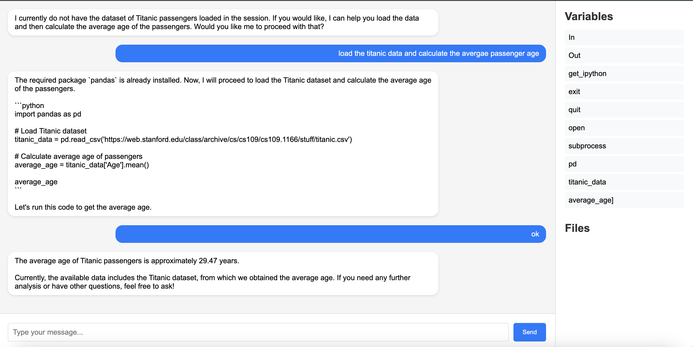
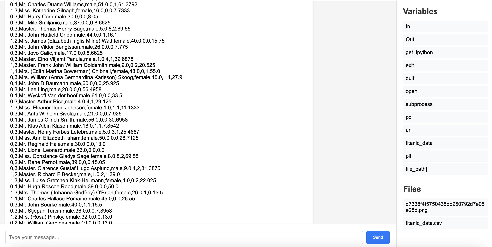

# Backend 

it has three endpoints in main.py

query
```
curl -X POST http://localhost:8012/query \
-H "Content-Type: application/json" \
-d '{"query": "analyze the last 5 days of AAPL stock data"}'
```

variables

```
curl http://localhost:8012/variables
```

```
curl http://localhost:8012/variable/apple_stock_data
```


files

```
curl http://localhost:8012/files
```

```
curl -O http://localhost:8012/file/plot.png
```

```
restart
```

```
upload csv
```


main is a backend session, i still need to design and implement the concept of sessions to create new chats and new directory for each chat, this is tricky because i need a new set of endpoints on a different URL based on the current design i did

also the concept of new user? 

# Front end

it has basic components

chat

show variables

show files


# Issues


Access issues: "It appears that there continues to be an issue with downloading files and generating plots in this environment. As such, I cannot execute the tasks of saving the Titanic dataset or plotting the age distribution directly here."
>>>> this has been solved

dependnecies within the jupyter server
>>> currently patched, can be handled better

jupyter server running locally

# next

Add a cleanup restart endpoint

introduce the concept of session


add a session token and validate with a database oyu create to keep track


